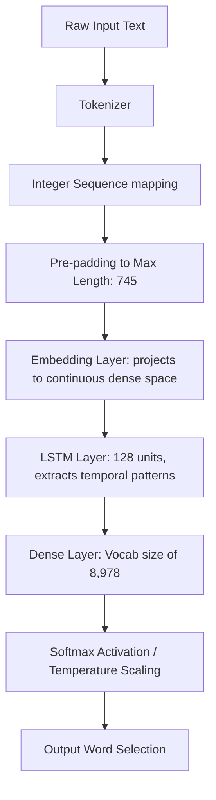

# 🔮 RNN-LSTM Next Word Predictor

[](https://tensorflow.org)
[](https://streamlit.io)
[](https://python.org)
[](https://plotly.com)

A premium, production-ready Deep Learning web application designed to forecast and generate text in real-time. Built with a Recurrent Neural Network (RNN) leveraging Long Short-Term Memory (LSTM) layers, the application translates linguistic patterns into probability distributions, predicting subsequent words based on preceding contexts. The app features a stunning glassmorphic UI, customizable temperature scaling, and interactive visualization of candidate words.

---

## 📖 Table of Contents
1. [Key Features](#-key-features)
2. [Technology Stack](#-technology-stack)
3. [Model Architecture](#-model-architecture)
4. [Mathematical & Theoretical Concepts](#-mathematical--theoretical-concepts)
5. [Project Structure](#-project-structure)
6. [Installation & Setup](#-installation--setup)
7. [How It Works](#-how-it-works)
8. [Recruiter Quick-Take](#-recruiter-quick-take)

---

## ✨ Key Features

*   **Real-Time Interactive Prediction:** Simply type any phrase, and the application instantly predicts the next sequences of words using real-time inference.
*   **Multi-Word Sequential Generation:** Predict between **1 to 20 consecutive words** to generate complete sentences from a simple prompt.
*   **Dual Inference Modes:**
    *   **Deterministic (Argmax):** Grabs the word with the absolute highest probability for stable, logical text generation.
    *   **Temperature-Based Sampling:** Introduces creativity, randomness, and diversity into the suggestions by tuning a **Sampling Temperature** ($0.1$ to $2.0$).
*   **Interactive Probability Charts:** Integrates a dynamic horizontal bar chart powered by **Plotly** to visualize the probability distribution scores of the top 5 candidate words.
*   **Interactive Candidate Table:** Displays precise confidence percentages for the top predicted candidates in a clean, tabular format.
*   **Quick-Start Prompts:** A curated dropdown of sample prompts allows recruiters and users to test the model across various contexts instantly.
*   **Premium Glassmorphic Design:** Styled with custom CSS, containing responsive cards, custom typography (Outfit and Space Grotesk), custom loading animations, and an optimized dark theme.

---

## 🛠️ Technology Stack

*   **Deep Learning Backend:**
    *   **TensorFlow & Keras:** Used for constructing, training, and running inference on the LSTM model.
*   **Web Framework & Interface:**
    *   **Streamlit:** Facilitates building the web UI in Python.
    *   **HTML5/CSS3:** Integrated via custom Markdown injection to establish a modern dark-mode glassmorphic aesthetic.
*   **Data Science & Visualization:**
    *   **Plotly Express:** Provides the responsive, interactive horizontal bar chart depicting word confidence distributions.
    *   **Pandas & NumPy:** Handle matrix manipulation, indexing, sorting, and probability array shaping.
*   **Serialization:**
    *   **Pickle:** Loads the vocabulary mapping (`tokenizer.pkl`) and sequence length limits (`max_len.pkl`) for preprocessing input.

---

## 🧠 Model Architecture

The core of this project is a **Sequential Recurrent Neural Network (RNN)** optimized for language modeling.



### Layer Details:
1.  **Tokenizer:** Converts textual strings into integer sequences using a pre-trained mapping of **8,978 unique tokens**.
2.  **Sequence Padding:** Pads input sequences to a maximum length of **745 tokens** using *pre-padding* (`padding='pre'`) to feed uniform shape tensors to the neural network.
3.  **Embedding Layer:** Maps the sparse vocabulary indices into a dense vector space, enabling the network to learn semantic associations between words.
4.  **LSTM Layer (128 Units):** A gated recurrent layer that maintains memory states across sequences, allowing it to capture long-term context and grammatical dependencies.
5.  **Dense Layer (8,978 Output Nodes):** Translates the LSTM's output features into raw logit values corresponding to every word in the vocabulary.
6.  **Softmax / Prediction Function:** Converts raw logits into probability distributions.

---

## 🧮 Mathematical & Theoretical Concepts

### Pre-Padding Sequence Lengths
To prepare text of length $L$ for a model configured with maximum length $M = 745$, the sequences are transformed:
$$\mathbf{X} = [\underbrace{0, 0, \dots, 0}_{M - L}, w_1, w_2, \dots, w_L]$$
This preserves the newest words near the end of the array, which are crucial for Recurrent Networks to compute final state updates.

### Temperature-Scaled Softmax
When selecting the next word, standard softmax maps raw logit output $z_i$ of word $i$ directly to a probability:
$$P(w_i) = \frac{\exp(z_i)}{\sum_{j} \exp(z_j)}$$

By introducing a **Sampling Temperature** $T \in [0.1, 2.0]$, the formula updates to:
$$P(w_i) = \frac{\exp\left(\frac{z_i}{T}\right)}{\sum_{j} \exp\left(\frac{z_j}{T}\right)}$$

*   **Low Temperature ($T \to 0.1$):** Amplifies differences. The largest logit dominates the probability distribution, making the predictions **highly deterministic** and repetitive.
*   **High Temperature ($T \to 2.0$):** Flattens the distribution. Logit differences are minimized, resulting in high entropy. Predictions become **creative, diverse, and random**.

---

## 📁 Project Structure

```
Next_word_prediction/
│
├── app.py                 # Main Streamlit application codebase and UI
├── lstm_model.keras       # Pre-trained Keras sequential LSTM model
├── tokenizer.pkl          # Pickled Keras Tokenizer containing 8,978 word vocabulary
├── max_len.pkl            # Pickled integer storing the maximum training sequence length (745)
└── README.md              # Project documentation (this file)
```

---

## ⚙️ Installation & Setup

Follow these steps to run the application locally on your machine.

### Prerequisites
Make sure you have **Python 3.8+** and `pip` installed.

### 1. Clone or Download the Directory
Navigate to your project directory:
```bash
cd Next_word_prediction
```

### 2. Create and Activate a Virtual Environment (Recommended)
**Windows (PowerShell):**
```powershell
python -m venv venv
.\venv\Scripts\Activate.ps1
```

**macOS/Linux:**
```bash
python3 -m venv venv
source venv/bin/activate
```

### 3. Install Dependencies
Install all required libraries:
```bash
pip install streamlit tensorflow pandas numpy plotly
```

### 4. Run the Streamlit Application
Start the local development server:
```bash
streamlit run app.py
```
After running, the application will automatically open in your default browser at `http://localhost:8501`.

---

## 🔄 How It Works

1.  **Initialization:** The app uses Streamlit's `@st.cache_resource` to load `lstm_model.keras`, `tokenizer.pkl`, and `max_len.pkl` into RAM. This ensures that predictions are computed instantly without reloading model weights on each keystroke.
2.  **Preprocessing:** When you type or select a prompt, the tokenizer maps words to integer sequences. Sequences longer than 745 are sliced, and sequences shorter are pre-padded with zeros.
3.  **Inference:** The tensor is passed to the LSTM model. The model outputs a vector of shape `(1, 8978)` containing the log-likelihood of each word.
4.  **Sampling:**
    *   If **Argmax** is active, the token ID with the maximum logit is selected.
    *   If **Temperature-Based** is active, logits are scaled by $T$ and run through a random choice distribution sampler.
5.  **Iteration:** If you selected a sequence prediction of $N$ words, the predicted word is appended to the original text, and the process runs again recursively.
6.  **Visualization:** The top 5 candidates' raw logits are converted to percentages and plotted using a custom Plotly horizontal bar chart.

---

## 💼 Recruiter Quick-Take

*   **Demonstrated Skills:**
    *   **Natural Language Processing (NLP):** Tokenization, padding, text sequencing, and vocabulary index handling.
    *   **Deep Learning:** Recurrent Neural Networks (RNNs), LSTM units, dense layers, logits, softmax, and temperature scaling.
    *   **Full-Stack ML Engineering:** Serialization (Pickle), model packaging (`.keras`), and deployment-ready scripting (`app.py`).
    *   **Frontend UI/UX Design:** CSS injection, theme design, data visualizations, and interactive widgets.
*   **Production Optimization:** Uses cached loaders (`st.cache_resource`) to achieve sub-100ms inference times on CPU, highlighting performance-minded software engineering.
